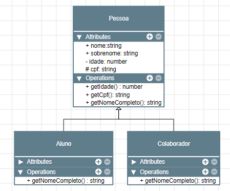
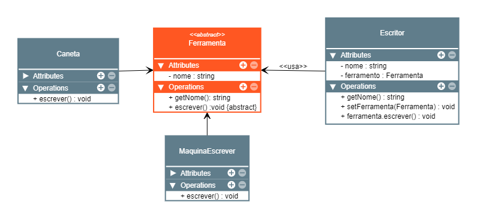
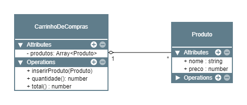
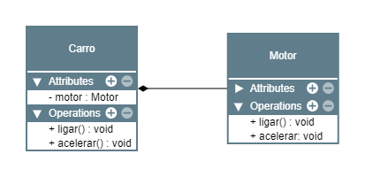

Belezera, aqui vou colocar algumas notas de typescript que estou aprendendo :3

- [Instalação](#instalação)
- [Tipos de arquivos](#tipos-de-arquivos)
- [Compilando arquivos](#compilando-arquivos)
- [Script e module mode](#script-e-module-mode)
- [Executando os arquivos .ts de maneira mais rápida](#executando-os-arquivos-ts-de-maneira-mais-rápida)
	- [instalação ts-node](#instalação-ts-node)
- [Configuração code runner](#configuração-code-runner)
- [Configurando o Eslint](#configurando-o-eslint)
	- [instalação](#instalação-1)
	- [Arquivo de configuração](#arquivo-de-configuração)
	- [Exemplo de `.eslintrc.js`](#exemplo-de-eslintrcjs)
	- [Instanado o Prettier](#instanado-o-prettier)
	- [Arquivo de configuração](#arquivo-de-configuração-1)
	- [Configurando o Prettier](#configurando-o-prettier)
- [Arquivo de configuração do TypeScript](#arquivo-de-configuração-do-typescript)
	- [Conteudo do arquivo](#conteudo-do-arquivo)
- [Buildando](#buildando)
- [Tipos privimitos](#tipos-privimitos)
	- [Tipos básicos](#tipos-básicos)
- [Arrays](#arrays)
- [Objetos](#objetos)
	- [Funções](#funções)
	- [Tipo any](#tipo-any)
	- [Void](#void)
	- [Tuple](#tuple)
	- [Undefined](#undefined)
	- [null](#null)
	- [Never](#never)
	- [enum](#enum)
	- [Unknown](#unknown)
	- [Union types](#union-types)
	- [Tipos literais](#tipos-literais)
	- [Type alias](#type-alias)
	- [Intersection Types](#intersection-types)
	- [Funções como tipo](#funções-como-tipo)
	- [Strutural type](#strutural-type)
	- [Type assertions](#type-assertions)
		- [Non-null assertion (!) - Não recomendado](#non-null-assertion----não-recomendado)
		- [Type assertion - Recomendado ✅](#type-assertion---recomendado-)
- [Configurando o webpack](#configurando-o-webpack)
	- [instalação](#instalação-2)
	- [Configuração](#configuração)
	- [Compilando arquivos](#compilando-arquivos-1)
- [Importação de libs que precisam de  declaration files](#importação-de-libs-que-precisam-de--declaration-files)
- [Utilizando o this dentro de  arrow functions](#utilizando-o-this-dentro-de--arrow-functions)
- [Classes](#classes)
	- [Criação](#criação)
	- [Acessos](#acessos)
		- [Public ( Cuidado ⚠ )](#public--cuidado--)
		- [Private ( Sempre tente utilizar esse ✅ )](#private--sempre-tente-utilizar-esse--)
		- [Protected ( Utilizado para herança )](#protected--utilizado-para-herança-)
	- [Herança 👪](#herança-)
		- [Polimorfismo](#polimorfismo)
		- [Exemplo](#exemplo)
		- [Construtores em subclasses](#construtores-em-subclasses)
		- [Super](#super)
	- [Getter e setter](#getter-e-setter)
	- [Atributos e metodos estaticos](#atributos-e-metodos-estaticos)
	- [Construtores privados e singletons](#construtores-privados-e-singletons)
	- [Classes, metodos e atributos abstrados 📄](#classes-metodos-e-atributos-abstrados-)
	- [Associação de classes](#associação-de-classes)
	- [Agregação entre classes](#agregação-entre-classes)
	- [Composição](#composição)
	- [implementando type alias em classes](#implementando-type-alias-em-classes)
	- [Interfaces](#interfaces)
		- [Declaration merging em interfaces](#declaration-merging-em-interfaces)
- [Tipos avançados](#tipos-avançados)
	- [Type guards (Validações de tipos)](#type-guards-validações-de-tipos)
	- [Keyof e typeof](#keyof-e-typeof)
	- [Utilizando chaves como tipos](#utilizando-chaves-como-tipos)
	- [Overload](#overload)
	- [Utilizando o this como tipo](#utilizando-o-this-como-tipo)
	- [Encadeiamento opcional](#encadeiamento-opcional)
	- [Operador de coalescencia nula](#operador-de-coalescencia-nula)
- [Generics](#generics)
	- [Array e promisses são genérics](#array-e-promisses-são-genérics)
	- [Gnerics com interfaces e type alias](#gnerics-com-interfaces-e-type-alias)
	- [Restrições em generics](#restrições-em-generics)
	- [Generics com classes](#generics-com-classes)
	- [Generics com intersection](#generics-com-intersection)
	- [Type Predicate](#type-predicate)
	- [Utility types](#utility-types)

# Instalação
```js
npm i typescript -D
```

# Tipos de arquivos
As extensões dos arquivos de typescript são definidos como `*.ts`

# Compilando arquivos
Para compilar os arquivos typescript para javascript

```js
npx tsc index.ts
```

# Script e module mode
O typescript trabalha com esses modos. O script mode será implementado por padrão no seu script. Ao utilizar `export` ele irá assumir que você está no modo de modulos.

No modo script ele assume boa parte do seu código como apenas um unico script, então você pode receber erros de declarações duplicadas por exemplo.

Já no modo módulo ele assume que seu script está separados por módulos, então com isso você não recebera erros de declarações repetidas por conta de outros arquivos por exemplo.

**Mas 99% você ira trabalhar com o module mode :3**

# Executando os arquivos .ts de maneira mais rápida
## instalação ts-node
```js
npm i ts-node -D
```
# Configuração code runner
Dentro do vscode, com a extensão de code-runner instalada, faça as seguintes personalizanações:
```json
{
	"code-runner.executorMap": {
		"typescript": "npx ts-node --files"
	}
}
```

# Configurando o Eslint
## instalação
```js
npm i eslint -D
npm i @typescript-eslint/eslint-plugin @typescript-eslint/parser -D
```

Se não tiver ainda, você precisa da extenção do es lint no vs code :3

## Arquivo de configuração
O Eslint precisa do arquivo `eslintrc.js` na raiz do seu projeto, para conseguir fazer as correções :3

## Exemplo de `.eslintrc.js`
Sem regras :3

```js
module.exports = {
  env: {
    browser: true,
    es6: true,
    node: true,
  },
  extends: [
    'eslint:recommended',
    'plugin:@typescript-eslint/eslint-recommended',
    'plugin:@typescript-eslint/recommended',
  ],
  globals: {
    Atomics: 'readonly',
    SharedArrayBuffer: 'readonly',
  },
  parser: '@typescript-eslint/parser',
  parserOptions: {
    ecmaVersion: 11,
    sourceType: 'module',
  },
  plugins: ['@typescript-eslint'],
  rules: {},
};
```

## Instanado o Prettier
```js
npm i prettier eslint-config-prettier eslint-plugin-prettier -D
```
## Arquivo de configuração 
Crie um arquivo chamado  `prettierrc.js` :3
Exemplo do conteudo desse arquivo: 
```js
module.exports = {
	semi: true,
	trailingComma: 'all',
	singleQuote: true,
	printWidth: 80,
	tabWidth: 2,
}
```
## Configurando o Prettier
Adicione a linha abaixo na chave `extends` do arquivlo `.eslintrc.js`
```js
'plugin:prettier/recommended',
```

# Arquivo de configuração do TypeScript
Existe um arquivo chamado `tsconfig.js` que aceita váaaaaaaarias configurações do typescript, você pode iniciar esse arquivo com o seguinte comando:

```js
npx tsc --init
```

## Conteudo do arquivo
Por padrão ele vem com muiiiiitas coisas comentadas, e somente algumas habilitadas

Um exemplo de arquivo já configurado é esse:

> Esse arquivo foi pego de um curso de 2019, então pode estar desatualizado ok 👍🏻

`tsconfig.json`
```json
{
  "compilerOptions": {
    /* Visit https://aka.ms/tsconfig.json to read more about this file */

    /* Basic Options */
    // "incremental": true,                   /* Enable incremental compilation */
    "target": "ES2019",                       /* Specify ECMAScript target version: 'ES3' (default), 'ES5', 'ES2015', 'ES2016', 'ES2017', 'ES2018', 'ES2019', 'ES2020', or 'ESNEXT'. */
    "module": "CommonJS",                     /* Specify module code generation: 'none', 'commonjs', 'amd', 'system', 'umd', 'es2015', 'es2020', or 'ESNext'. */
    "lib": ["ESNext", "DOM"],                 /* Specify library files to be included in the compilation. */
    "allowJs": true,                       /* Allow javascript files to be compiled. */
    // "checkJs": true,                       /* Report errors in .js files. */
    // "jsx": "preserve",                     /* Specify JSX code generation: 'preserve', 'react-native', or 'react'. */
    // "declaration": true,                   /* Generates corresponding '.d.ts' file. */
    // "declarationMap": true,                /* Generates a sourcemap for each corresponding '.d.ts' file. */
    "sourceMap": true,                        /* Generates corresponding '.map' file. */
    // "outFile": "./",                       /* Concatenate and emit output to single file. */
    "outDir": "./dist",                       /* Redirect output structure to the directory. */
    "rootDir": "./src",                       /* Specify the root directory of input files. Use to control the output directory structure with --outDir. */
    // "composite": true,                     /* Enable project compilation */
    // "tsBuildInfoFile": "./",               /* Specify file to store incremental compilation information */
    "removeComments": true,                   /* Do not emit comments to output. */
    // "noEmit": true,                        /* Do not emit outputs. */
    "noEmitOnError": true,
    // "importHelpers": true,                 /* Import emit helpers from 'tslib'. */
    // "downlevelIteration": true,            /* Provide full support for iterables in 'for-of', spread, and destructuring when targeting 'ES5' or 'ES3'. */
    // "isolatedModules": true,               /* Transpile each file as a separate module (similar to 'ts.transpileModule'). */

    /* Strict Type-Checking Options */
    "strict": true,                           /* Enable all strict type-checking options. */
    // "noImplicitAny": true,                 /* Raise error on expressions and declarations with an implied 'any' type. */
    // "strictNullChecks": true,              /* Enable strict null checks. */
    // "strictFunctionTypes": true,           /* Enable strict checking of function types. */
    // "strictBindCallApply": true,           /* Enable strict 'bind', 'call', and 'apply' methods on functions. */
    // "strictPropertyInitialization": true,  /* Enable strict checking of property initialization in classes. */
    // "noImplicitThis": true,                /* Raise error on 'this' expressions with an implied 'any' type. */
    // "alwaysStrict": true,                  /* Parse in strict mode and emit "use strict" for each source file. */

    /* Additional Checks */
    // "noUnusedLocals": true,                /* Report errors on unused locals. */
    // "noUnusedParameters": true,            /* Report errors on unused parameters. */
    // "noImplicitReturns": true,             /* Report error when not all code paths in function return a value. */
    // "noFallthroughCasesInSwitch": true,    /* Report errors for fallthrough cases in switch statement. */

    /* Module Resolution Options */
    // "moduleResolution": "node",            /* Specify module resolution strategy: 'node' (Node.js) or 'classic' (TypeScript pre-1.6). */
    // "baseUrl": "./",                       /* Base directory to resolve non-absolute module names. */
    // "paths": {},                           /* A series of entries which re-map imports to lookup locations relative to the 'baseUrl'. */
    // "rootDirs": [],                        /* List of root folders whose combined content represents the structure of the project at runtime. */
    // "typeRoots": [],                       /* List of folders to include type definitions from. */
    // "types": [],                           /* Type declaration files to be included in compilation. */
    // "allowSyntheticDefaultImports": true,  /* Allow default imports from modules with no default export. This does not affect code emit, just typechecking. */
    "esModuleInterop": true,                  /* Enables emit interoperability between CommonJS and ES Modules via creation of namespace objects for all imports. Implies 'allowSyntheticDefaultImports'. */
    // "preserveSymlinks": true,              /* Do not resolve the real path of symlinks. */
    // "allowUmdGlobalAccess": true,          /* Allow accessing UMD globals from modules. */

    /* Source Map Options */
    // "sourceRoot": "",                      /* Specify the location where debugger should locate TypeScript files instead of source locations. */
    // "mapRoot": "",                         /* Specify the location where debugger should locate map files instead of generated locations. */
    // "inlineSourceMap": true,               /* Emit a single file with source maps instead of having a separate file. */
    // "inlineSources": true,                 /* Emit the source alongside the sourcemaps within a single file; requires '--inlineSourceMap' or '--sourceMap' to be set. */

    /* Experimental Options */
    "experimentalDecorators": true,           /* Enables experimental support for ES7 decorators. */
    "emitDecoratorMetadata": true,            /* Enables experimental support for emitting type metadata for decorators. */

    /* Advanced Options */
    "skipLibCheck": true,                     /* Skip type checking of declaration files. */
    "forceConsistentCasingInFileNames": true  /* Disallow inconsistently-cased references to the same file. */
  },
  "include": [
    "./src"
  ]
}
```

# Buildando
Bora buildar?

Para buildar o código é muito simples se você já tiver o `tsconfig.json` já configurado, e eu vou contar que você tenha ahusdhfua

Então basta executar o comando abaixo:
```js
npm tsc
```

Com isso ele deve criar a pasta do build com todos os arquivos dentro

# Tipos privimitos

## Tipos básicos
```typescript
let nome: string = 'texto'; // qualquer tipo de string
let idade: number = 10; // 10, 10.43, -5.55, 0xf00d, 0b1010, 0o7744
let adulto: boolean = true; // true ou false
let simbolo: symbol = Symbol('Qualquer symbol'); // symbol
let big: bigint = 10n;
```

# Arrays
`:Array<Tipo do dado>`

```typescript
let arrayNumeros: Array<number> = [1,2,3];
//let arrayNumeros: number[];
let arrayTexto: Array<string> = ['a', 'b', 'c'];
//let arrayTexto = string[];
```

# Objetos
`Chave: TipoDado`

Quando você já seta valores dentro do objeto, ele já sofre inferencia de tipos, então não é necessário setar os tipos dos valores, porem quando você não faz isso é necessário setar os tipos.

Você pode colocar o simbolo ? para indicar que um atributo não é obrigatório

```ts
// Exemplo setando os tipos dos valores
let pessoa: {nome: string, idade: number, adulto?: boolean}

// Exemplo já sofrendo inferencia
const pessoa = {
	readonly nome: 'Willian',
	idade: 999,
	adulto: true,
};
```

## Funções

```ts
// => indica o tipo do retorna da função
const soma: (x: number, y:number) => number => x + y;


// Aqui ele já sabe que o retorno será um number
function soma2(x: number, y:number){
	return x + y;
}
```


## Tipo any
Você deve setar o valor any, quando realmente quise utilizar any, mas não é incado. Porém vai saber quando serpa necessário não é mesmo? :3

```ts
function tipoAny(msg: any){
	return msg;
}
```

## Void
```ts
function printName(name: string):void {
	console.log(`You are amazing ${name}!`);
};
```

## Tuple
Array com valores fixos, mas só se você quiser :3

```ts
// Definindo um valor para cada posição do array
const dadosCliente: readonly [number, string] = [1, 'Willian'];

//Mais exemplos
const dadosClienteV2: readonly [number, ...string[]] = [1,'Willian', 'Bora', 'Estudar'];

const dadosClienteQuePodemSerMudados: [number, string] = [1, 'Willian'];
```

## Undefined
Quando não definimos se pode ou não existir o retorno. Geralmente utilizado em objetos ou arrays em campos com o simbolo de ?, declarando a não obrigatoriedade.

```ts
// Exemplo
export function createPerson(
	firstName: string,
	lastName?: string, 
) : {
	firstName: string;
	lastName?: string; // Aqui vai retornar undefined
} {
	return {
		firstName,
		lastName,
	}
}

//Ficou beeeeem verboso mas a sequenci acima significa: FUNÇÃO => TIPO DE DADOS => TIPO DE RETORNO (OBJETO) => CORPO DA FUNÇÃO

```

## null
Quando retornamos nulo em uma função, fica como responsabilidade para a próxima etapa a validar

```ts
//Exemplo de retorno number | null
const function calculaQuadrado(x: any){
	if(typeof x === 'number') return x * x;
	return null;
}
```

## Never
Quando algo nunca vai retornar nada

```ts
// Nunca vai retornar nada
export function criaErro(): never {
	thow new Error('Erro qualquer')
}
```

## enum
Utilizado para enumerar as coisas

```ts
enum Cores {
	VERMELHO,
	AZUL,
	AMARELO
};
console.log(Cores.VERMELHO) //0
//Ou

enum Cores {
	ROXO = 10,
	VERDE = 20,
	ROSA = 30
};
console.log(Cores.ROXO) //10
console.log(Cores[0]) //ROXO

// CAAAARA e ele uni as coisas viu, atualmente o Cores está assim
// Unindo os dois Cores acima
Cores {
	VERMELHO,
	AZUL,
	AMARELO,
	ROXO = 10,
	VERDE = 20,
	ROSA = 30,
}
```

## Unknown
Funciona de maneira semelhante de any, porém nele existem algumas restrições que deixam esse tipo mais seguro, por exemplo: Não é possível realizar contas com esse tipo de dados, por não saber o tipo do valor que está armazenado nele

> Bom utilizar ele no lugar do any

```ts
let x : unknown;
const y = 10; //tipagem dinamica

console.log(x + y) //Erro: Não é possível realizar a conta com o x, pois ele é unknown
```

## Union types

Quando existe mais de um tipo de retorno, podemos dizer iso para o typescript através do sinal de pipe |

Porém quando se usa mais um tipo de dado em um campo, o typescript tera mais vigor em pedir validações para você

```ts
string | number | boolean // ou string ou number ou boolean

//exemplo
//O typescript requer que validações do campo seja feita
function add (x: number | string, y: number | string): number | string {
	if (typeof(x) === 'number' && typeof(y) === 'number') return x + y;
	return `${x}${y}`;
};
```

## Tipos literais

Utilizar valores como tipos

Como assim? Por exemplo, temos a seguinte linha `const x = 10;` o valor literal será um number, porém o subtipo será 10, já que boa parte dos números é um subtipo de number.

Então em teoria temos: 
- Tipo => Subtipo
	- String => 'Willian'
	- Number => 10

Ai podemos escolher oque usar em nossas variavel, objetos e arrays. Vamos utilizar o tipo ou o subtipo? Quando se da para utilizar o subtipo, você está limitando ainda mais a gama de coisas que podem entrar no campo, por um lado aumenta deverás a segurnaça, porém por outro você limita o campo.

Exemplo
```ts
const pessoa = {
	nome: 'Willian' as const, // O valor desse campo será o subtipo da string que será 'Willian' :3. O nome do que aconteceu aqui é asserção
	sobrenome: 'Soncini'
}

// O tipo do dado passado para essa função, só poderá ser 'Azul' ou 'Amarelo'. E não qualquer string
function escolhaCor(cor: 'Azul' | 'Amarelo') {
	return cor;
}
```

## Type alias

Agora podemos criar nossos próprio tipos de dados. Sente o poder 🚀

Definimos o tipo do dados através da palavra  `type`

É como se você estivesse fazendo um contrato.

Exemplo

```ts
type Idade = number;
type Pessoa = {
	nome: string,
	idade: Idade,
	corPreferida?: string,
};

type CorRGB = 'vermelho' | 'verde' | 'azul';
type CorCMYK = 'ciano' | magenta | 'amarelo';
type CorPreferida = CorRGB | CorCMYK;

const pessoa: Pessoa = {
	idade 30,
	nome: 'Willian',
	salario: 999_999_999_999_999, //Ele aceita os números separados por virgula tranquilamente
}

expor function setCorPreferida(pessoa: Pessoa, cor: CorPreferida) : Pessoa {
	return { ...pessoa, corPreferida: cor};
}

setCorPreferida(pessoa, 'Azul');
```

Lembrando que no código acima não está sendo criado nenhuma variavel, somente tipos de variaveis.

## Intersection Types

A gente tem os operadores `|` e o `&`, que são resprectivamente  `Ou E`. Enquanto o operador 'OU' não obriga a atribuição do valor, o operador 'E' obriga fazer essa atribuição.

Exemplos

```ts
type TemNome = { nome: string };
type TemSobrenome = { sobrenome: string};
type Pessoa = Temnome & TemSobrenome | TemIdade;

// Com isso ele obrigara os campos 'nome, sobrenome', e não obrigara o campo idade.
const pessoa: Pessoa = {
	nome: 'Willian',
	sobrenome: 'Soncini',
};
```

Porém da para utilizar isso para pegar oque tem em comum entre tipos.

Para quem já fez `INNER JOIN` é muito parecido, porém oque é pego é somente as chaves de ligamento

Exemplo:
```ts
type AB = 'A' | 'B';
type AC = 'A' | 'C';

type Intersecao = AB & AC // 'A' - Traz oque os types tiver em comum.
```


## Funções como tipo

Assim como definimos tipos do tipo objeto, é possível definir tipos com funções.

```ts
//Definindo o tipo como uma função
type MapStringsCallback = (item: string) => string;

function mapStrings(array: string[], callbackfn: MapStringCallback): string[] {
	const newArray: string[] = [];
	for (let i; i < array.length; i++){
		//Passando o array[i] como 'item'
		newArray.push(callbackfn(array[i]));
	}

	return newArray;
}

const abc ['a', 'b', 'c'];
//A função está retornando uma string, assim como definido em seu tipo
const abcMapped = mapStrings(abc, (item) => item.toUpperCase());
```

## Strutural type
Usado para estruturar os tipos que farão determinado processo. Isso é muit utilzado em interfaces para definição de regas, segue um exemplo abaixo:

```ts
// Aqui criamos as regras dessa funcionalidade
type VerifyUserFn = (user: User, sentValue: User) => boolean;
// Aqui definimos constrato
type User = { username: string, password: string}

const verifyUser : VerifyUser = (user, sentValue) => {
	return user.username === sentVale.usernmae && user.password === sentValue.password;
}

const bdUser = { username: 'Willian', password: 'strong_pass'};
const sentUser = { username: 'Willian', password: 'strong_pass'};
// Seguimos a regra e aplicamos o contrato corretamente
const loggedIn = verifyUser(bdUser, sentUser); // true
```

## Type assertions
Utilizado para indicar qual sera o tipo do campo. Por muitas vezes, funções e outras possibilidades podem retornar vários valores, por exemplo `string | null` , então com a asserção de tipos, podemos garantir qual será o tipo do campo.

> Para utilizar isso é necessário ter o campo `["DOM"]`, dentro do array `"lib"` no arquivo `tsconfig.json`

### Non-null assertion (!) - Não recomendado
Indicado com o simbolo `!` ao final do código
```ts
const body = document.querySelector('body')!;
```

### Type assertion - Recomendado ✅
```ts
const body = docuent.querySelector('body') as HTMLBodyElement;
```

# Configurando o webpack
Vamos trabalhar com fronend?

Sempre é mais indicado consultar a documentação colega :3

https://webpack.js.org/guides/typescript/

## instalação
```node
npm i ts-loader webpack webpack-cli -D
```

## Configuração
Exemplo de configuração em modo desenvolvimento

Dados pertencentes ao arquivo `webpack.config.js`

```js
const path = require('path');

module.exports = {
  mode: 'development',
  entry: './src/index.ts',
  module: {
    rules: [
      {
        test: /\.tsx?$/,
        use: 'ts-loader',
        exclude: /node_modules/,
      },
    ],
  },
  resolve: {
    extensions: ['.tsx', '.ts', '.js'],
  },
  output: {
    filename: 'bundle.js',
    path: path.resolve(__dirname, 'dist'),
  },
  devtool: 'source-map',
};
```

## Compilando arquivos
```js
npx webpack
npx webpack -w //Para ele ficar assistindo as sua mudanças
```

# Importação de libs que precisam de  declaration files
Quando importamos uma lib para nosso projeto, é necessário importar na versão de devensolvimento essa lib para o typescript.

Por exemplo vamos importar a lib `validator` para nosso projeto, então precisamos fazer a instalação da seguinte forma se estivermos utilizando o typescript.

```node
npm i validator
npm i @types/validator -D
```

Assim garatimos que a lib funcione no typescript enquanto estamos desenvolvendo :3

> Sinceramente não sei se é necessário fazer isso para todas as libs

# Utilizando o this dentro de  arrow functions
> Tome cuidado em utilizar this em arrow functions

O `this` de uma arrow function sempre será pego de onde a função é declarada, então com muita facilidade você pode acabar utilizando o `this` global em vez do `this`  do contexto que deseja :3

# Classes
Com classes podemos deixar nosso código mais organizado e seguro. Podemos aplicar diversos conceitos de segurança para isso, então utilizar classes para encapsulamento é só sucesso!

> Classes podem ser utilizadas como tipos também!

## Criação
Só demonstrando algumas formas de definir uma class

**Primeira e mais delicinha**

```ts
class Empresa {
	constructor(
		private nome: string,
	)
}
```

**Segunda - Aqui fica mais verboso**

```ts
class Empresa {
	private nome : string;

	constructor(nome: string){
		this.nome = nome;
	};
}
```

## Acessos
Para acessar os valores dos atributos de uma classe, podemos utilizar três operadores.

[Referencia das informações](https://pt.stackoverflow.com/questions/23/qual-%C3%A9-a-diferen%C3%A7a-entre-modificadores-public-default-protected-e-private)

```
 Modifier      Class   Package   Subclass   World
──────────────────────────────────────────────────
 public          ✔        ✔         ✔         ✔

 protected       ✔        ✔         ✔         ✘

 no modifier     ✔        ✔         ✘         ✘

 private         ✔        ✘         ✘         ✘
──────────────────────────────────────────────────
```

### Public ( Cuidado ⚠ )
O atributo que receber esse tipo de acesso, poderá ter seu valor modificado externamente.

> Um atributo que é alterado externamente não tem segurança nenhuma, então tome muito cuidado ao utilizar esse operador

```ts
class Empresa{
	constructor(
		public nome: string,
	){}
};

const empresa = Empresa('Tesla');
empresa.nome = 'Amazon';

//Todo mundo vai poder alterar essse cara, isso é péssimo! Toma cuidado com isso aqui @-@
```

### Private ( Sempre tente utilizar esse ✅ )
O atributo que receber esse tipo de acesso, não poderá ter seu valor modificado externamente. Somente a classe que o declarou poderá o acessar, oque nos trás diversas vantagens em termos de encapsulamento e segurança.

```ts
class Empresa {
	constructor(
		private readonly nome: string,
	){}
};

const empresa = new Empresa('Tesla');
```

### Protected ( Utilizado para herança )
Isso aqui nos permite ter acesso por herança. Se uma classe extende de outra classe, essa tera acesso a seus atributos protected. Atributos protected só podem ser acessados pelas classes estendidadas e pela super classe.

> É tipo um private, só que compartilhado ahsidfuh

```ts
export class Colaborador{
	constructor (
		protected readonly nome: string,
	){}
};

export class Empresa {
	private readonly colaboradores : Coladores[], // Aqui consigo ter acesso ao campo protect numa boa, poderia fazer colaboradores[n].nome = 'Thomaz' se fosse necessário.

	constructor(
		private readonly nome : string,
	){}

	adicionaColaborador(colaborador: Colaborador){
		this.colaboradores.push(colaborador);
	}
};

const empresa = new Empresa('Telsa');
const colaborador = new Colaborador('Albert');
empresa.adicionaColaborador(colaborador);
```

## Herança 👪
Com herança podemos reutilizar muito código, e nela podemos aplicar polimosfirmos, caso desejemos algum comportamento diferente da classe pai.

Uma herança funciona da seguinte forma: O pai tem suas caracteristicas. Quando um pai tem um filho, o filho também terá as caracteristicas do pai. Assim é na programação também.

### Polimorfismo
Quando um filho precisa ter um comportamento diferente do pai, ele pode sobreescrever o método do pai, com suas proprias caracteristicas.

### Exemplo
Considere a seguinte estrutura

Site uitlizado: https://www.yworks.com/yed-live/



- \+ Publico
- \- Privado
- \# Protected

Em código teremos algo parecido com:

```ts
class Pessoa{
	constructor(
		public nome : string,
		public sobrenome: string,
		private idade: number,
		protected cpf: string,
	){};

	getIdade() : number { return this.idade};
	getCpf(): string { return this.cpf };
	getNomeCompleto() : string { return `${this.nome} ${this.sobrenome}`;
};

class Aluno extends Pessoa {
	// Polimorfismo - O filho terá um comportamento diferente do pai
	getNomeCompleto(): string {
		return `ALUNO: ${this.nome} ${this.sobrenome}`
	};
}

class Colaborador extends Pessoa{
	// Polimorfismo - O filho terá um comportamento diferente do pai
	getNomeCompleto() : string {
		return `COLABORADOR: ${this.nome} ${this.sobrenome}` 
	}
}
```

### Construtores em subclasses
Ao utilizar construtores em suas subclasses, você deve tomar cuidado para não sobrescrever a super classe.

Mas caso você precise de construtores em suas sub classes, o código ficara mais ou menos assim:

```ts
//Super classe
class Pessoa{
	constructor(
		private nome : string,
		private sobrenome: string,
	);
};

//Sub-classe
class Aluno extends Pessoa {
	constructor(
		// Dessa maneira você não estará sobreescrevendo o atributo da superclasse.
		// Apenas está indicando que a classe Aluno precisa também dos campos nome e sobrenome, isso devido a super classe.
		nome: string, 
		sobrenome: string,
		private registroEscolar : string,
	) {
		super(nome, sobrenome);
	}

}
```

### Super
Algumas vezes precismos acessar a super classe a partir de subclasses, então para isso temos os metodo super.

```ts
class Pessoa{
	constructor(
		private nome : string,
	){};
	getNome() : string { return this.nome };
};

class Colaborador extends Pessoa {
	getNome() : string {
		console.log('Fazendo algo antes da chamada do super');
		super.getNome(); // Aqui estamos chamando o metodo genuino, que vem lá da classe pai (Super classe)
	}
}
```

## Getter e setter
A maneira como o javascript trabalha com getter e setters é mais ou menos da seguinte forma.

> Por conversão o atributo que recebera o getter ou o setter, fica com o nome com um underline antes, mais ou menos assim \_nome

```ts
class Pessoa{
	constructor(
		private _nome : string,
	) {}

	set nome(nome:string){
		this._nome = nome;
	}
	get nome(): string {
		return this._nome;
	}
}

const pessoa = new Pessoa('Willian');
pessoa.nome // getter
pessoa.nome = 'Albert' // setter
```

## Atributos e metodos estaticos
Métodos estaticos são acessados pela classe, porém sem a necessidade de instanciala.

```ts
class Pessoa {
	static semSobrenome = '';

	constructor(
		private nome: string,
		private sobrenome: string,
	){}
	
	static criaPessoa(nome: string): Pessoa {
		return new Pessoa(nome: string, Pessoa.semSobrenome)
	};
}

const pessoa = new Pessoa.criaPessoa('Willian');
```

## Construtores privados e singletons
Não permitir existir mais do que uma instancia, quando a classe for ser instanciada, ou retorna a instancia existente ou cria uma nova, mas sempre existira somente uma.

```ts
export class Database {
	private static database: Database;

	private constructor(
		private host: string,
		private database: string,
		private user: string,
		private password: string,
	);

	static getDatabase(
		host:string,
		database:string,
		user:string,
		password:string,
	): Database {
		if (Database.database) return Database.database;
		Database.database = new Database(host, database, user, passwor);
		return Database.database;
	}
}

const db = Database.getDatabase('localhost', 'awesome_db', 'willian', 'strong_pass');
```

## Classes, metodos e atributos abstrados 📄
Algo abstrato é algo apenas para servir como contrato, para forçar algo a ser implementado.

Por exemplo, uma classe que é abstrata não podera ser implementada, ela servira somente para que outras classes herdem dela.

Um método abastrato, devera ser implementado por todos aqueles que herdarem da super classe abstrata.

> Se existe algo abstrato na super classe, as sub-classes terma que implementar tais coisas.

Exemplo

```ts
// Essa classe nunca podera ser instanciada diretamente, ele server apenas como um contrato para que as outras classes implementem e tenham oque nela há.
abstract class Personagem {
	protected abstract emoji: string; // Todos que herdarem dessa classe, deveram implementar esse atributo

	constructor(
		private nome : string,
		private vida : number,
		private ataque: number,
	){}

	atacar(personagem : Personagem) : void {
		this.bordao();
		personagem.vida -= this.ataque;
	};

	abstract bordao() : void; // Todos que herdarem dessa classe, terá que implementar esse metodo.
}

class Guerreira extends Pernagem {
	// A classe Personagem obriga a implementação do atributo abstrato emoji
	protected emoji = '🧝🏻‍♀️';

	// A classe Personagem obriga a implementação do método abstrato 'bordao'
	bordao(){
		console.log(`${this.emoji} - Classe guerreira ao ataque!`);
	};
}

class Monstro extends Personagem {
	// A classe Personagem obriga a implementação do atributo abstrato emoji
	protected emoji = '👾';

	// A classe Personagem obriga a implementação do método abstrato 'bordao'
	bordao(){
		console.log(`${this.emoji} - Vem pro monstro vem!`);
	};
}

const gurreira = new Guerreira('Guerreira', 25400, 3510);
const monstro = new Monstro('Monstro', 45052, 1451);

gurreira.atacar(monstro);
monstro.atacar(gurreira);
```

## Associação de classes
Uma classe usa outra sem que necessáriamente dependa da outra. Associação mais fraca.

Exemplo abaixo:



```ts
abstract class Ferramenta{
	constructor(
		private _nome : string,
	){}

	get nome() : string {
		return this._nome;
	};

	abstract escrever() : void;
}

class Caneta extends Ferramenta{
	escrever() : void {
		console.log('Escrevendo com caneta');
	};
}

class MaquinaEscrever extends Ferramenta{
	escrever() : void {
		console.log('Maquina digitando');
	};
}

class Escritor {
	private _ferramenta: Ferramenta | null = null;

	constructor(
		private _nome : string,
	){}

	get nome() : string {
		return this._nome;
	};

	set ferramenta (ferramenta: Ferramenta | null): void {
		this._ferramenta = ferramenta;
	};
	
	escrever(): void {
		if (this.ferramenta === null){
			console.log('Não posso escrever sem ferramenta');
			return;
		}
		this._ferramenta.escrever();
	};
}

```

Vale lembrar que aqui também foi aplicado a **inversão de dependencia**, onde o escritor não depende diretamente da caneta ou da maquina de escrever, mas sim de um contrato, que fica responsavél por garantir que o escritor receba aquilo que ele espera.

Escritor fica dependente da class abstrata Ferramenta, que é utilizada em Caneta e Maquina de escrever. 

## Agregação entre classes
Um carro funciona sem rodas, porém para funcionar adequadamente, ele necessita das rodas. Isso é a agregação, quando algo depende de outra coisa.

 Considere o seguinte exemplo

 

```ts
class Produto {
	constructor(
		public nome : string,
		public preco : number,
	){}
}

class CarrinhoDeCompras{
	constructor(
		// Aqui está dependencia
		private produtos : Produto[],
	){}

	inserirProduto(produto : Produto) : void {
		this.produtos.push(produto);
	};

	quantidade() : number {
		return this.produtos.length;
	};

	total() : number {
		return this.produtos.reduce((soma, produto) => soma + produto.preco, 0);
	}
}

```

## Composição
Um objeto tem outro como parte dele memso. Resumindo uma classe não existe sem a outra, a classe é totalmente dependente da outra.

Considere o seguinte exemplo com carros



```ts
class Motor{
	ligar(): void {
		console.log('Motor ligado');
	}

	acelerar() : void {
		console.log('Moto acelerando')
	}
}

class Carro{
	// Aqui está a composição
	// O Carro não consegue existir sem o a classes Motor
	private readonly motor : new Motor();

	ligar(): void {
		motor.ligar();
	};

	acelerar(): void{
		motor.acelerar();
	}
}
```

## implementando type alias em classes
Ira funcionar como um contrato assim como as coisas abstratas, porém com algumas diferenças.

A implementação via tipos, não podera receber modificadores de acessos como private ou protected, sempre deverá ser public, pois o intuito de uma tipo é expor seus campos mesmo.

> Caso precise de modificadores de acesso, classes são uma melhor opção

Vale lembrar que muitos tipos podem ser implementados ✅

Exemplo

```ts
type TipoPessoa = {
	nome: string;
	sobrenome: string;
	nomeCompleto: () => string;
}

// Implementação
class Pessoa implements TipoPessoa {
	constructor(
		public nome: string,
		public sobrenome: string,
	){}

	nomeCompleto() : string {
		return `${this.nome} ${this.sobrenome}`
	}
}
```
 
## Interfaces
É um contrato que é utilizado pelas classes. Neste contrato assim como no exemplo acima, definimos campos e métodos que a classes precisaram implementar.

Aqui no typscript, type e interface tem a mesma funcionalidade em relação as classes, então as duas opções podem servir como constrato para a classe.

exemplo

```ts
// Mudança para interface
interface TipoPessoa {
	nome: string;
	sobrenome: string;
	nomeCompleto: () => string;
}

// Implementação
class Pessoa implements TipoPessoa {
	constructor(
		public nome: string,
		public sobrenome: string,
	){}

	nomeCompleto() : string {
		return `${this.nome} ${this.sobrenome}`
	}
}
```

### Declaration merging em interfaces

Várias interfacez são unidas se transformando em uma interface maior

```ts
interface Pessoa{
	nome: string;
}

interface Pessoa {
	readonly sobrenome : string;
} 

const pessoa : Pessoa = {
	nome: 'Willian David',
	sobrenome: 'Soncini',
}
```

# Tipos avançados
## Type guards (Validações de tipos)
São validações que são utilizadas para que as validações do typescript funcionem.

Acontece muito quanto temos dois tipos em um unico tipo, dessa forma, cabe ao desenvolvedor fazer as devidas validações para que o typescript entenda, a qual tipo ele está se refirindo.

Exemplo da validações

```ts
type Pessoa {
	nome: string,
}

type Animal {
	cor: string,
}

type PessoaOuAnimal = Pessoa | Animal;

function monstraNome(obj = PessoaOuAnimal) : void {
	if ('nome' in obj) console.log(obj.nome);
	if (obj instanceof Pessoa) console.log(obj.nome)
}
```

## Keyof e typeof
Que maravailha em! Com isso aqui podemos pegar os tipos e chaves que estão em um objeto, isso facilita muito, pois as vezes precisamos de algo mais dinamico.

Exemplo

```ts
const coresObj = {
	vermelho: 'red',
	verde: 'green',
	azul : 'blue',
}

// Pegando tipos e chaves dinamicamente
type CoresObj = typeof coresobj;
type CoresChaves = keyof coresobj;

function traduzirCor(cor: CoresChaves, cores: CoresObj){
	return cores[cor];
}

console.log(traduzirCor('vermelho', coresObj)); // red
```

## Utilizando chaves como tipos
Caso seja necessário utilizar as chaves de outro typo ou objeto em algum outro local, é possível realizar tal façanha indicando a chave do objeto.

```ts
type Veiculo = {
	marca: string;
	ano: string;
};

type Car = {
	brand: Veiculo['marca'];
	year: Veiculo['ano'];
	nome: string;
}
```

## Overload
Uma função se comporta de maneira diferente dependendo da sua quantidade de parametros.

```ts
type Adder = {
	(x: number) : number;
	(x: number, y: number) : number;
	(...args: number[]) : number;
};

// Comportamento diferente mediante a quantidade de parametros que são passados.
const adder: Adder = (x: number, y?: number, ...args: number[]) => {
	if (args.length > 0) return args.reduce((soma, valorAtual) => soma + valorAtual) + x + (y || 0);
	return x + (y || 0);
}

console.log(adder(1)) //1
console.log(adder(1,2)) //3
console.log(adder(1,2,3)) //6
 ```

## Utilizando o this como tipo 
Utilizando o this como tipo, podemos realizar chamadas em cadeia, pois oque será retornado é o proprio objeto. Então nos permite realizar uma manipulação do objeot de maneira deiferente.

Mais abaixo tem um exemplo utilizando design pattner builder

exemplo básico

```ts
class Calculadora{
	constructor(public numero: number){}
	
	add(n: number) : this {
		this.numero += n;
		return this
	}
	
	sub(n: number) : this {
		this.numero -= n;
		return this
	}
}

const calculadora = new Calculadora(10);

//Retornando o this, podemos fazer chamadas em cadeia
calculadora.add(50).sub(5) // 55
```

**Exemplo utilizando o padrão builder - GoF**

> Com este padrão você pode ir 'construindo' o objeto aos poucos, em vez de definir tudo no construtor

```ts
class RequestBuilder{
	private method: 'get' | 'post' | null = null;
	private url : string | null = null;

	setMethod(method: 'get' | 'post') : this {
		this.method = method;
		return this;
	}

	setUrl(url: string): this {
		this.url = url;
		return this;
	}

	send() : void {
		console.log('Enviando os dados!')
	}
}

const request = new RequestBuilder();
request.setUrl('https://www.google.com.br');
request.setMethod('post').send() // Enviando os dados!
```

## Encadeiamento opcional
O encadeamento opcional trás uma segurança maior para nosso código, para que quando algo não existir, o valor undefined será retornado.

Caracterizado pelo sinal '?' antes da chamada ao método

```ts
type Documento = {
	titulo: string;
	data? : Date;
}

// Aqui não deifnimos data
const documento : Documento = {
	titulo: 'Titulo',
}

// Em vez da linha abaixo quebrar nosso código, o valor undefined será trazido.
console.log(documento.data?.toDateString()); // undefined
```

## Operador de coalescencia nula
Checa nulo e undefined. Funciona de maneira semelhante a um coalesce do banco de dados. Caso o valor não existe, oque foi definido na coalescencia nula será executado.

Caracterizado pelo sinal '??'

> Só avalia não valores, que são null e undefined.

Exemplo

```ts
console.log( null ?? 'Não existe valor'); // Não existe valor
console.log( undefined ?? 'Não existe valor'); // Não existe valor
```


# Generics
Utilizando quando não sabemos qual será o tipo concreto.

Utilizando tipos genéricos, podemos atribuir tipos dinamicamente para um objeto, função ou tipo, essa aplicabilidade se da em vários lugares diferentes.

> Um tipo genérico pode receber qualquer nome, porém por convenção a letra T é utilizada

No exemplo abaixo, a função saberá perfeitamente que os parametros passados serão um number, e que seu retorno será um array de numbers também, porém poderia ser de string, isso dependeria do tipo de dado que passemos. O tipo do parametro que passarmos será o tipo que sera assumido por T (Tipo genérico)

```ts
// Tipo genérico sendo aplicado (T)
type FilterCallBack<T> = (
	value: T,
	index?: number,
	array?: T[],
) => boolean;

// Tipo genérico sendo aplicado (T)
export function meuFiter<T>(
	array: T[], callbackfn: FilterCallBack<T>
	) : T[] {
	const novoArray = [];

	for (let 1 = 0; i < array.length; i++){
		if (callbackfn(array[i])) {
			novoArray.push(array[i]);
		}

		return novoArray;
	}
}

const array = [1,2,3,4,5,6,7];
const arrayFiltrado = meuFilter(array, (value) => value < 5);
console.log(arrayFiltrado); // [1,2,3,4]
```

## Array e promisses são genérics
Você pode setar os valores corretos para promises e arrays, porém geralmente o typescript infere esses tipos. Porém em situações pouco complexas, o ts não conseguira inferir o tipo de suas promises, como por exemplo em consultas a Api's

Tipo genérico de array: `Array<T>`  onde T se trata de um tipo genérico, então você precisa inferir um tipo

**Promises**

Da para setar os tipos que serão inferidos pela Promises

exemplo
```ts
// Inferindo o tipo em promises
async function minhaPromise() : Promise<number> {
	return new Promise((resolve, reject) => {
		setTimeout(() => {
			resolve(1);
		}, 1000);
	});
}

minhaPromise().then((resultado) => console.log(resultado)) // 1
```

## Gnerics com interfaces e type alias
Da para utilizar genérics nas interfaces e types normalmente

Exemplo

```ts
// Colocando os genérics, tipos funcionam da mesma forma.
interface Pessoa<T, U> {
	nome: T,
	sobrenome: U,
}

// inserindo os tipos dos genérics
const pessoa: Pessoa<string, string> = {
	nome: 'Willian',
	sobrenome: 'Soncini',
}

// Aqui neste tipo, inferimos tipos padrões
type Carro<T = string, U = number> {
	modelo: T,
	velocidadeMaxima = U,
}

// Por ter tipos padrões mão é necessário inferir os tipos no código, mas caso fosse um tipo diferente seria somente inferir
const carro: Carro = {
	modelo: 'Bugatti Chiron',
	velocidade: 400
} 
```

## Restrições em generics
As vezes o genérico estara muito amplo, então sera necessário aplicar restrições sobre ele.

exemplo

No exemplo abaixo, definimos que K será no máximo uma chave de K, é assim que se le o código abaixo. Tal restrição permite que o typescrit entenda que K faz parte de O, logo ele permitira tal código.

> Extends dentro dos genéricos significa uma restrição

```ts
type ObterChaveFn = <O, K extends keyof O> (objeto: O, key: K) => O[K];

const obterChaveFn: ObterChaveFn = (objeto, chave) => objeto[chave];

const pessoa = {
	nome: 'Willian'
};

const nomeObjeto = obterChaveFn(wilian, 'nome'); // Willian

```

## Generics com classes
Quando um tipo genérico é muito utilizado dentro de uma classe, as vezes o typescript não conseguira inferir os valores, então caberá ao desenvolvedor inferir tais tipos.

No exemplo abaixo tivemos que inferir o tipo do genérico para que o typescriot consiga entender a dinamica de seus retornos. Tal tipo inferido, pode ser um number ou uma string.

exemplo

```ts
class Pilha<T>{
	private contador = 0;
	// objeto com array
	private elements: {[k: number]: T} = {}

	push(elemento: T): void {
		this.elementos[this.contador] = elemento;
		this.contador++;
	}

	pop(): T | void {
		if (this.estaVazia()) return undefined;

		this.contador--;
		const elemento = this.elemento[this.contador];
		delete this.elemento[this.contador];
		return elemento;
	}

	estaVazia() :boolean {
		return this.contador === 0;
	}
}

const pilha = new Pilha<number | string>();
pilha.push(1);
pilha.pop(); // 1
```

## Generics com intersection
Criar um novo objeto a partir da união de dois objetos genéricos

```ts
function unirObjetos<T, U> (obj1: T, obj2: U) : T & U {
	//return {...obj1, ...obj2};
	return Object.assign({}, obj1, obj2);
}

const obj1 = { chave1: 'primeiro objeto'};
const obj1 = { chave2: 'segundo objeto'};

const novoObjeto = unirObjetos(obj1, obj2); // { chave1: 'primeiro objeto', chave2: 'segundo objeto' }
```

## Type Predicate
Em funções que retornam boolean, podemos inferir o tipo se baseando em quando o retorno for verdadeiro.

exemplo

```ts
//inferindo number quando o retorno for verdadeiro
function isNumber(value: unknown) : value is number {
	return typeof value === 'number';
}

function soma<T>(...args: T[]) : number {
	const retorno = args.reduce((soma, valor) => {
		if (isNumber(soma) && isNumber(valor)){
			//Aqui ele sabera que os dois valores serão number, devido ao retorno predicado da função acima
			return soma + valor;
		}

		return soma;
	}, 0);
}

console.log(soma(1,2,3))// 6
```

## Utility types
Com os métodos abaixo é possivel realizar desde filtros até a transformações de campos de seus tipos. 

São os principais

```ts
// Somente criando os tipos
type Tipo = {id: string}
type ABC = 'A'|'B'|'C';
type CDE = 'C'|'D'|'E';

//Utility types
type TipoRequired = Required<Tipo> // Deixa todos os campos de seu tipo como required
type TipoPartial = Partial<Tipo> // Deixa todos os campos de seu tipo como não requerido
type TipoReadonly = Readonly<Tipo> // Deixa todos os campos como readonly
type TipoPick = Pick<Tipo, 'id'> // Pega somente as chaves que você escolher
type ABCExclude = Exclude<ABC, CDE> // Computa somente oque há de diferente entre os dois tipos - AB
type ABCExtract = Extract<ABC, CDE>// Trás somente oque há de igual entre os tipos - C
```

# Decorators
É um objeto que finge ser seu objeto real, ele pode realizar coisas antes de entregar o objeto.

**Ele está em experimento ainda no começo de 2022, então tome cuidado com o uso dele**

Link docs: https://www.typescriptlang.org/docs/handbook/decorators.html

> Para que funcione se lembre de descomentar as seguintes linhas no seu arquivo `tsconfig.json`

```json
	"ExperimentalDecorators": true,
	"emitDecoratorMetadata" : true,
```

Exemplo simples

```ts
export class Animal {
	constructor(public cor : string) {}
}

function decorador(target: any): any {
	console.log('Posso fazer algumas coisas antes!');
	return target;
}

const AnimalDecorated = decorador(Animal);
const animal = new AnimalDecorated('roxo');
console.log(animal);
```

Perceba que a classe foi entregue mas eu poderia altera-la antes de entregar de fato para minha variavel.

É isso que vamos fazer abaixo:

Exemplo de utilização com alteração de classes

```ts
interface Constructor {
	new (...args: any[]): any;
}

@decorador
export class Animal {
	constructor(
		public nome: string,
		public cor: string,
	)
}

function decorador (target: Constructor) {
	return class extends target {
		cor: string;
		nome: string;

		constructor(...args: any[]){
			super(...args);
			this.nome = nome.toUpperCase();
			this.cor = cor.toUpperCase();
		}
	}
}

const animal = new Animal('Spike', 'Marrom');
animal // { nome: 'SPIKE', cor: 'MARROM'}
```

Exemplo de utilização com alteração de classes utilizando genérics

```ts
@decorador
export class Animal {
	constructor(
		public nome: string,
		public cor: string,
	)
}
// Tipando o construtor da classe utilizando o new
function decorador<T extends new (...args: any[]) => any> (target: T): T{
	return class extends target {
		cor: string;
		nome: string;

		constructor(...args: any[]){
			super(...args);
			this.nome = nome.toUpperCase();
			this.cor = cor.toUpperCase();
		}
	}
}

const animal = new Animal('Spike', 'Marrom');
animal // { nome: 'SPIKE', cor: 'MARROM'}
```

No exemplo acima é possível implementar um decorator para a classe de Animal, tornando possível implementar novos métodos e validações para a classe. Assim podemos implementar o decorator diretamente utilizando a própria classe Animal, devido ao trecho `@decorator`

## Decorator Factories
É um função que retorna uma função decoradora, com ela é possível receber parametros para usarmos dentro do decorator.

```ts
interface Constructor {
	new (...args: any[]): any;
}


@factoryDecorator('Decoretor');
export class Animal {
	constructor(
		public nome: string,
	)
}

function factoryDecorator (param: string){
	return function (target: Constructor) {
		constructor(...args: any[]){
			super(...args);
			this.nome = nome + param;
		}
	}
}

const animal = new Animal('Spike'); // { nome: 'SpikeDecorator' }
```

## Composição de decoradores
Da para utilizar mais de uma decorador para a mesma classe

```ts
interface Constructor {
	new (...args: any[]): any;
}

@outroDecorator //2
@factoryDecorator('Decoretor'); //1
export class Animal {
	constructor(
		public nome: string,
	)
}

function outroDecorator(target: Constructor) {
	console.log('Sou o outro decorator');
}

function factoryDecorator (param: string){
	return function (target: Constructor) {
		constructor(...args: any[]){
			super(...args);
			this.nome = nome + param;
		}
	}
}

const animal = new Animal('Spike'); // { nome: 'SpikeDecorator' }
```

## Decoradores de métodos (method decorator)
Você pode assim como mudar a classe, mudar também o método. Podendo alterar desde suas configurações de writable até seus valores de retorno.

```ts
function decorador (
	classPrototype: any,
	nomeMetodo: string,
	descriptor: PropertyDescriptor,
) : PropertyDescriptor {
	return {
		writable: false,
		enumerable: false,
		configurable: false,
		// Aqui estamos alterando o retorno genuino da função
		value: function (..args: string[]) {
			return args[0].toUpperCase();
		}
	}
}

class Pessoa {
	constructor(
		private nome: string,
	){}
	
	// Agora esse métdodo terá as configurações que estão setadas no decorador
	@decorador
	metodo(): string {
		return `${this.nome} arrasa!`
	}
}

const pessoa = new Pessoa('Albert');
pessoa.metodo(); // ALBERT ARRASA!
```

## Decorador de parametro
Pelo que foi visto em aula, ainda não conseguimos alterar o valor de um parametro via decorador, ele serve mais para assistir e trazer algumas informações, caso ache pertinente.

```ts
function decorador (
	classPrototype: any,
	nomeMetodo: string | symbol,
	index: number,
) : any {
	console.log(classPrototype);
	console.log(nomeMetodo);
	console.log(index);
}

class Pessoa {
	constructor(
		@decorador private nome: string,
	){}
}

const pessoa = new Pessoa('Albert');
```

## Decorador de propriedades
Deixa você alterar desde as propriedades de um parametro, até mesmo configurar get e set por meio do decorador.

Exemplo

```ts
function decorador (
	classPrototype: any,
	nome: string | symbol,
) : any {
	let valorPropriedade: any;
	return {
        writabe: true,
		get: () => valorPropriedade,
		set: (valor: any) => valorPropriedade = valor,
	}
}

export class Pessoa {
    @decorador
    nome: string;

	constructor(nome: string){
        this.nome = nome;
    }
}

const pessoa = new Pessoa('Albert');
pessoa.nome = 'Einstein';
console.log(pessoa.nome) // Einstein
```

## Todos os decoradores
Através desse link, você pode conferir uma vasta gama de exemplo com decoradores

https://github.com/luizomf/cursojstypescript/blob/master/src/A0058-todos-os-decorators/A0058-todos-os-decorators.ts


